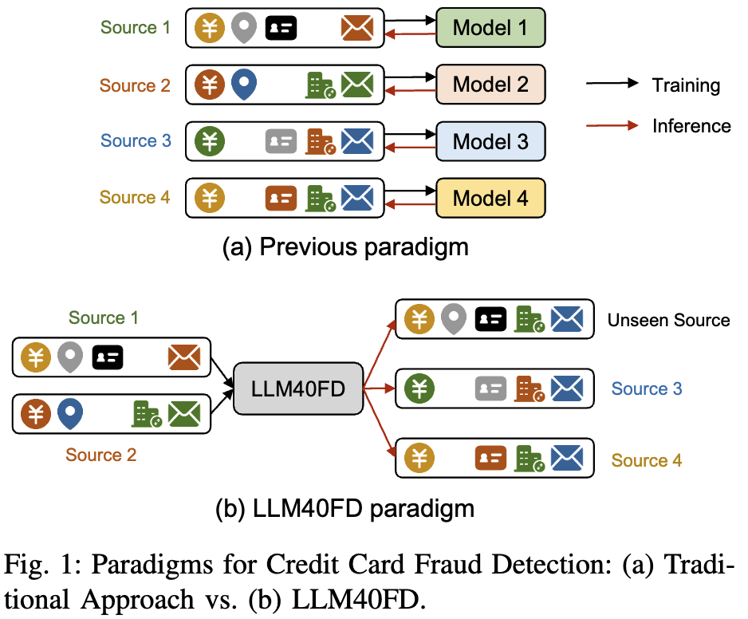
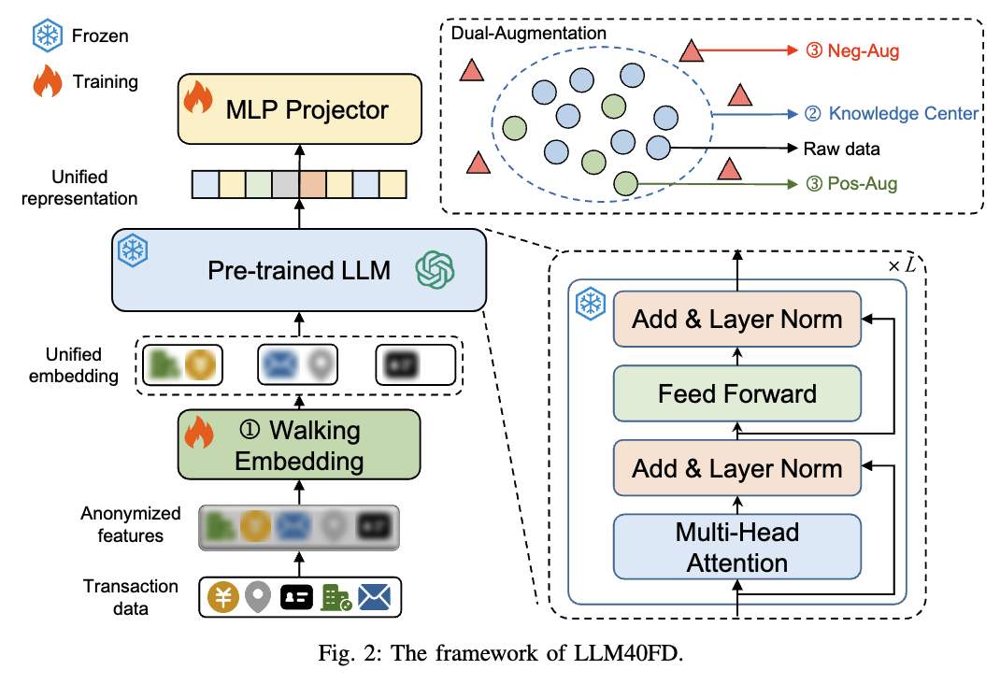
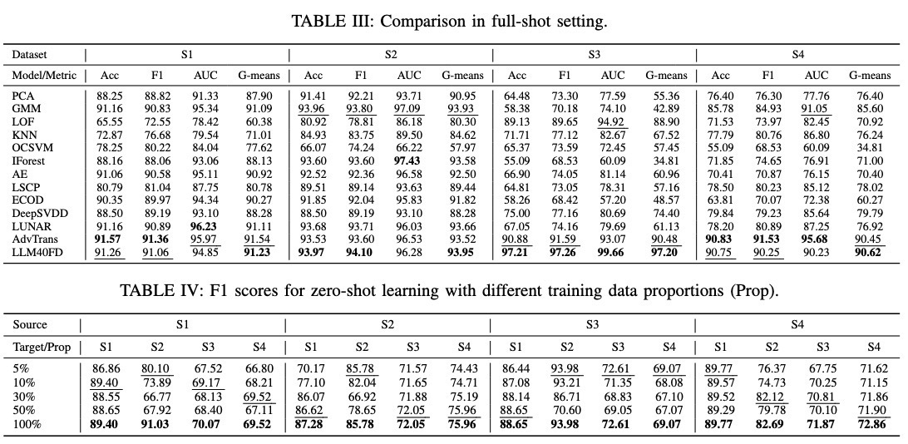

# LLM40FD

This is the official implementation of ***LLM40FD: Unlocking the Potential of LLM for Anonymous Zero-shot Fraud Detection.***

**Abstract**: Credit card fraud detection within the realm of financial security faces challenges such as data imbalance, large-scale anonymized transaction datasets, and the need for system-specific model training. Past methods often fail to address these aforementioned issues simultaneously. Utilizing a single model results in a lack of zero-shot capability without adaptation for real-world scenarios. This paper introduces LLM40FD, a novel framework that leverages a Large Language Model (LLM) to overcome these obstacles in anonymous zero-shot fraud detection. LLM40FD addresses the aforementioned challenges in credit card fraud detection by employing a Distribution-based One-Class function and the Walking Embedding, without reliance on labeled data or fine-tuning in downstream. Additionally, LLM40FD enhances the model’s ability to detect fraudulent patterns and define robust decision boundaries. This is achieved through a dual-augmentation strategy and implicit contrastive learning, which generate enriched positive and negative samples. Our experiments demonstrate that LLM40FD not only achieves state-of-the-art performance in the full-shot setting but also exhibits strong zero-shot capability even with limited training data. Furthermore, we conduct additional experiments to validate the effectiveness and working mechanism of LLM40FD.

## Architecture

Paradigms for Credit Card Fraud Detection

The framework of LLM40FD.

## Performance Comparison

## Quick start

TODO

## Datasets

TODO. Refer to our paper.

# Package

TODO.

# Citation

We will supplement it soon.

# TODO List

TODO

### Argument Parser Documentation

This document provides a detailed explanation of the command-line arguments used in the `LLM40FD` project. These arguments are parsed using the `argparse` module in Python.

#### Basic Configuration

| Argument          | Type | Default  | Choices | Description                                                              |
| ----------------- | ---- | -------- | ------- | ------------------------------------------------------------------------ |
| `--seed`        | int  | 2024     | N/A     | Random seed for reproducibility.                                         |
| `--debug`       | int  | 0        | N/A     | Debug mode. A value of 1 enables debug mode, while 0 disables it.        |
| `--saving_name` | str  | 'normal' | N/A     | Name of the directory for saving results.                                |
| `--zero_shot`   | int  | 1        | N/A     | Enable zero-shot learning. A value of 1 enables it, while 0 disables it. |

#### Data Loader

| Argument        | Type | Default                                                                                                        | Choices                         | Description                                                                               |
| --------------- | ---- | -------------------------------------------------------------------------------------------------------------- | ------------------------------- | ----------------------------------------------------------------------------------------- |
| `--dataset1`  | str  | 'shu'                                                                                                          | ['20k', 'credit', 'jop', 'shu'] | Type of the first dataset.                                                                |
| `--dataset2`  | str  | "20k,credit,jop,shu"                                                                                           | N/A                             | Type of the second dataset. The string should be a comma-separated list of dataset names. |
| `--root_path` | str  | r'/share/home/202220143416/anomaly_data/fraud_detection/' **tip! replace it to /your/dataset/path** | N/A                             | Root path of the data files.                                                              |

#### Model Definition

| Argument         | Type | Default       | Choices                   | Description                                                                                                                                                   |
| ---------------- | ---- | ------------- | ------------------------- | ------------------------------------------------------------------------------------------------------------------------------------------------------------- |
| `--enc_in`     | int  | 7             | N/A                       | Encoder input size. Note that this is not necessary as the encoder input size can be obtained automatically.                                                  |
| `--d_model`    | int  | 128           | N/A                       | Dimension of the model.                                                                                                                                       |
| `--strides`    | list | [1, 3, 5, 11] | N/A                       | Strides of the walking embedding.                                                                                                                             |
| `--llm_layers` | int  | 3             | N/A                       | Number of layers in the large language model (LLM).                                                                                                           |
| `--llm_model`  | str  | 'GPT2'        | ['GPT2', 'LLAMA', 'None'] | Type of the large language model to use.                                                                                                                      |
| `--llm_dim`    | int  | 768           | [4096, 768]               | Dimension of the large language model. For example, LLama7b has a dimension of 4096, GPT2-small has a dimension of 768, and BERT-base has a dimension of 768. |
| `--device`     | str  | 'cuda'        | N/A                       | Device to use for training, either 'cuda' for GPU or 'cpu' for CPU.                                                                                           |

#### Optimization

| Argument                     | Type  | Default | Choices                   | Description                                      |
| ---------------------------- | ----- | ------- | ------------------------- | ------------------------------------------------ |
| `--num_workers`            | int   | 10      | N/A                       | Number of workers for the data loader.           |
| `--train_epochs`, `-ep`  | int   | 1       | N/A                       | Number of training epochs.                       |
| `--few_data_per`           | float | 0.1     | [0.05, 0.1, 0.3, 0.5, 1.] | Percentage of data to use for few-shot learning. |
| `--batch_size`, `-bs`    | int   | 64      | N/A                       | Batch size of the training input data.           |
| `--learning_rate`, `-lr` | float | 0.0001  | N/A                       | Learning rate of the optimizer.                  |
| `--loss`                   | str   | 'OC_CE' | N/A                       | Loss function to use for training.               |
| `--pos_r`                  | float | 0.8     | N/A                       | Positive ratio.                                  |
| `--neg_r`                  | float | 2       | N/A                       | Negative ratio.                                  |
